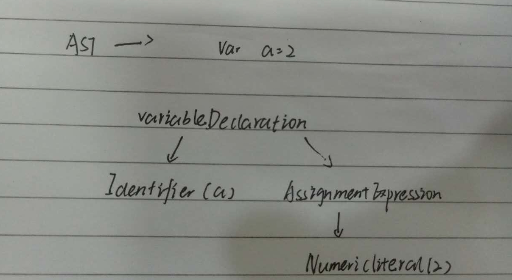
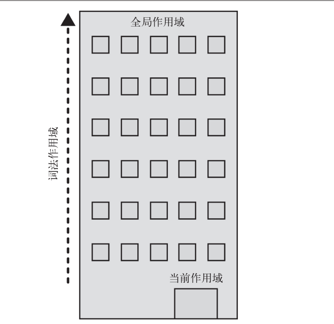

## 作用域

#### 一、 编译原理

尽管通常将 JavaScript 归类为“动态” 或“解释执行” 语言， 但事实上它是一门编译语言。
程序中的一段源代码在执行之前会经历三个步骤， 统称为“编译”

1. 分词/词法分析（Tokenizing/Lexing）
    * 这个过程会将由字符组成的字符串分解成（对编程语言来说） 有意义的代码块， 这些代
码块被称为词法单元（token）。 例如， 考虑程序 var a = 2;。 这段程序通常会被分解成
为下面这些词法单元： var、 a、 =、 2 、 ;。

2. 解析/语法分析（Parsing）
    * 这个过程是将词法单元流（数组） 转换成一个由元素逐级嵌套所组成的代表了程序语法
结构的树。 这个树被称为“抽象语法树”（Abstract Syntax Tree， AST）。
    

3. 代码生成
    * 将 AST 转换为可执行代码的过程称被称为代码生成。 

## 作用域

#### 作用域嵌套

当一个块或函数嵌套在另一个块或函数中时， 就发生了作用域的嵌套。 因此， 在当前作用
域中无法找到某个变量时， 引擎就会在外层嵌套的作用域中继续查找， 直到找到该变量，
或抵达最外层的作用域（也就是全局作用域） 为止。
将作用域处理的过程可视化，如下面的建筑：


#### 作用域欺骗

JavaScript 中有两个机制可以“欺骗” 词法作用域： eval(..) 和 with。 前者可以对一段包
含一个或多个声明的“代码” 字符串进行演算， 并借此来修改已经存在的词法作用域（在
运行时）。 后者本质上是通过将一个对象的引用当作作用域来处理， 将对象的属性当作作
用域中的标识符来处理， 从而创建了一个新的词法作用域（同样是在运行时）


#### 函数作用域

1. 匿名和具名
    始终给函数表达式命名是一个最佳实践

    ```JavaScript
    setTimeout( function timeoutHandler() { // <-- 快看， 我有名字了！
        console.log( "I waited 1 second!" );
    }, 1000 );
    ```

2. 立即执行函数表达式

    ```JavaScript
    <!-- 第一种 -->
    var a = 2;
    (function foo() {
        var a = 3;
        console.log( a ); // 3
    })();

    console.log( a ); // 2

    <!-- 第二种形式 -->
    (function foo(){ .. })()

    <!-- 进阶 -->
    <!-- 将 window 对象的引用传递进去， 但将参数命名为 global -->
    var a = 2;
    (function IIFE( global ) {
        var a = 3;
        console.log( a ); // 3
        console.log( global.a ); // 2
    })( window );

    console.log( a ); // 2

    <!-- IIFE 还有一种变化的用途是倒置代码的运行顺序， 将需要运行的函数放在第二位， 在 IIFE执行之后当作参数传递进去。 -->
    var a = 2;
    (function IIFE( def ) {
        def( window );
    })(function def( global ) {
        var a = 3;
        console.log( a ); // 3
        console.log( global.a ); // 2
    });

    ```
    *函数表达式 def 定义在片段的第二部分， 然后当作参数（这个参数也叫作 def） 被传递进
IIFE 函数定义的第一部分中。 最后， 参数 def（也就是传递进去的函数） 被调用， 并将
window 传入当作 global 参数的值。*

    **函数不是唯一的作用域单元。 块作用域指的是变量和函数不仅可以属于所处的作用域，
也可以属于某个代码块（通常指 { .. } 内部）。**

## 变量提升

先有蛋（声明） 后有鸡（赋值）。
只有声明本身会被提升， 而赋值或其他运行逻辑会留在原地。 

#### 函数优先

函数声明和变量声明都会被提升。 但是一个值得注意的细节（这个细节可以出现在有多个
“重复” 声明的代码中） 是函数会首先被提升， 然后才是变量。